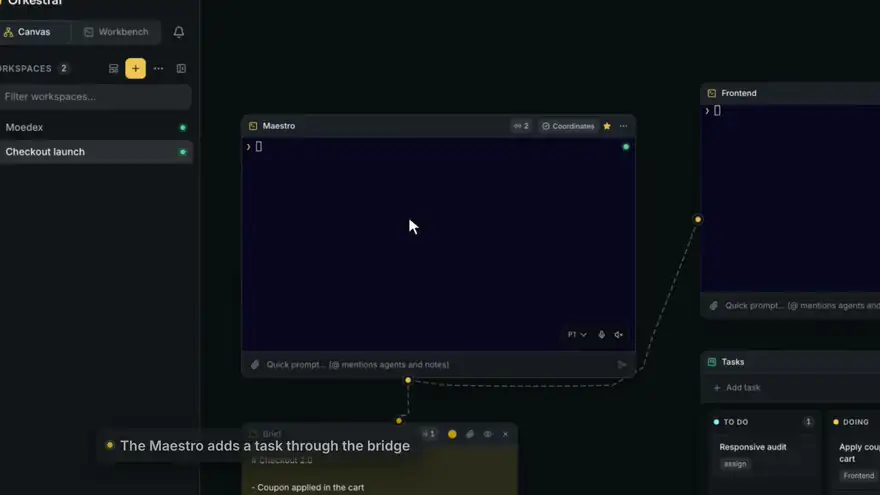
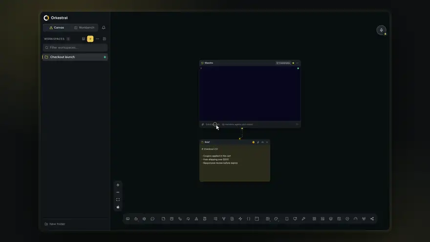
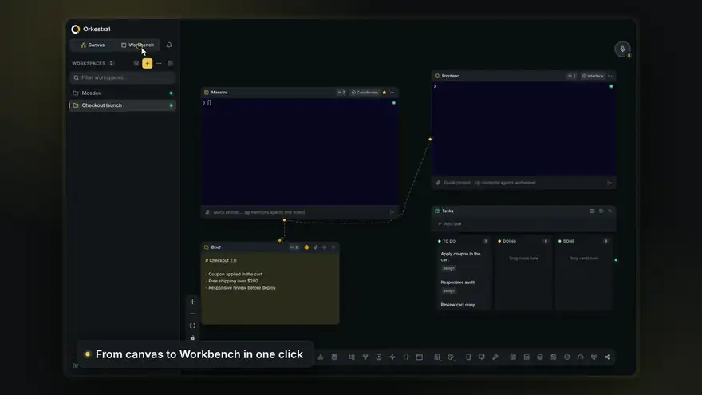
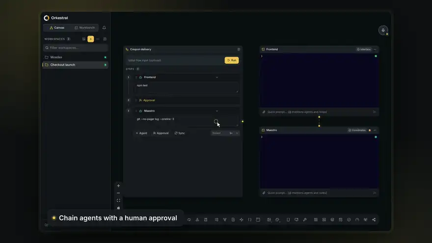
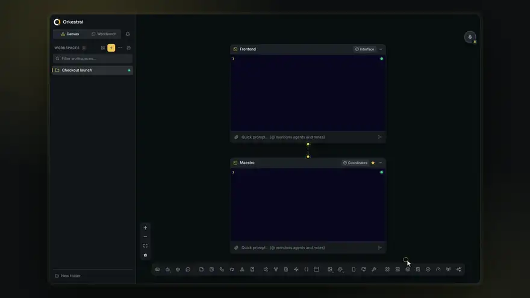
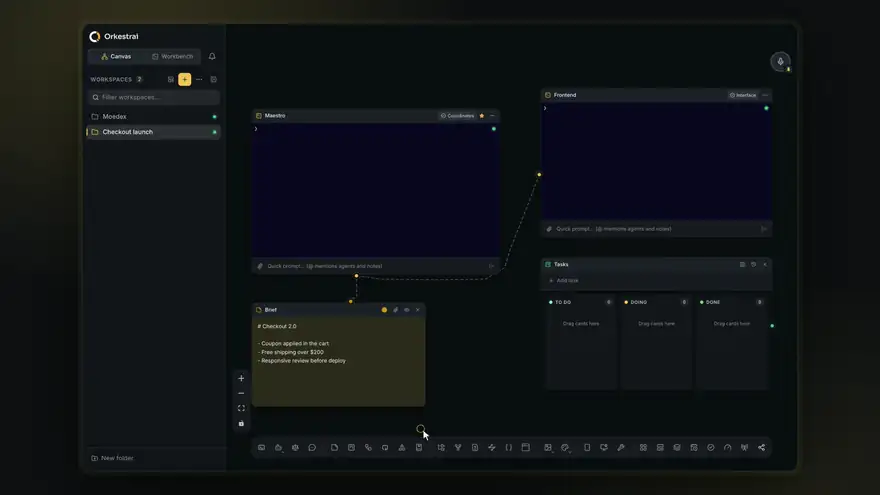
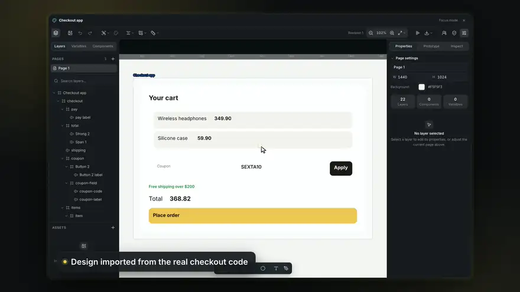
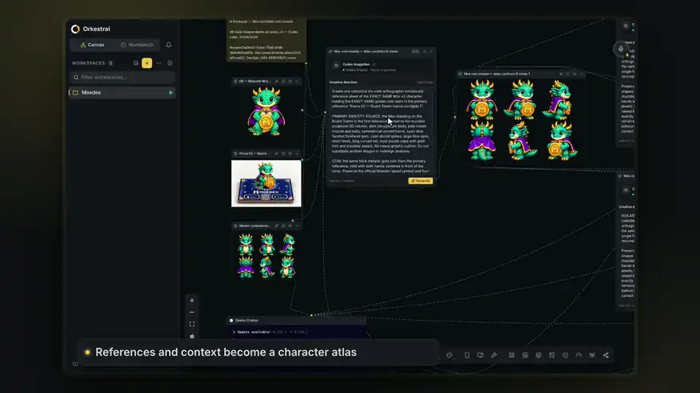
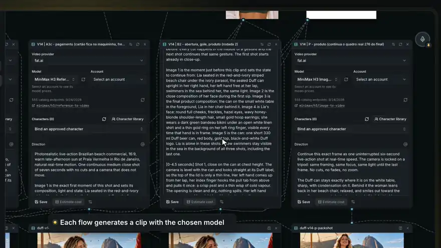
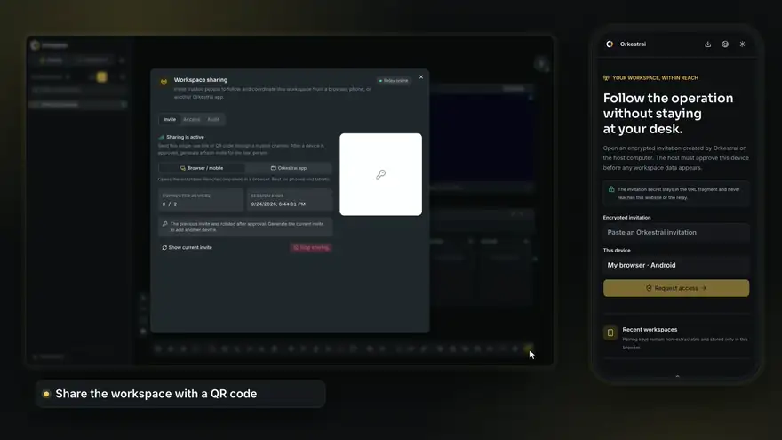

<p align="center">
  
</p>

<p align="center">
  <strong>Orquestre times de IA para criar, projetar, divulgar e entregar em um canvas visual.</strong>
</p>

<p align="center">
  <a href="https://github.com/beeblock/orkestrai/releases/latest"></a>
  
  <a href="LICENSE"></a>
</p>

<p align="center">
  <a href="https://github.com/beeblock/orkestrai/releases/latest"><strong>Baixar para macOS, Windows ou Linux</strong></a> · <a href="https://orkestrai.app/pt-BR">orkestrai.app</a>
</p>

<p align="center">
  <a href="README.md">English</a> · Português (Brasil) · <a href="README.es.md">Español</a>
</p>

<p align="center"></p>

Orkestrai é um aplicativo desktop local-first para macOS, Windows e Linux. Ele
reúne Claude Code, Codex CLI, Kimi Code, OpenCode, Cursor, Antigravity, Cline,
Devin, shells, tarefas, notas,
navegadores e worktrees Git em um canvas persistente onde devs, vibe coders,
designers, marketers e creators podem dirigir um time de IA em tempo real.

## Veja em ação

Cada clipe abaixo foi gravado no app de verdade: terminais, comandos e resultados
reais, sem nada simulado. Assista com legendas em português, inglês e espanhol
em [orkestrai.app](https://orkestrai.app/pt-BR).

### Monte o time no canvas

Arraste terminais, notas, quadros de tarefas, fluxos e mais da doca direto para o
canvas, anote o que o time precisa saber e conecte ao agente certo.

<p align="center"></p>

### Trabalhe lado a lado no Workbench

Vá do canvas ao Workbench em um clique, arraste itens para painéis divididos e
mantenha terminais reais em tamanho cheio ao lado de quadros, notas e arquivos.

<p align="center"></p>

### Encadeie agentes com aprovação humana

Fluxos passam o trabalho de um agente para o próximo, esperam a sua aprovação e
registram cada execução.

<p align="center"></p>

### Automatize o trabalho recorrente

Crie uma automação em segundos: escolha o agente e o que ele deve fazer e execute
agora ou por gatilho.

<p align="center"></p>

### Um Segundo cérebro que o time inteiro pesquisa

Importe documentos, acompanhe cada ligação no grafo de conhecimento e explore em
3D. Os agentes pesquisam os mesmos trechos com fonte pela ponte.

<p align="center"></p>

### Transforme código real em design nativo

Importe um design do código do seu projeto, refine no inspetor e transforme cada
mudança em uma revisão que volta como código.

<p align="center"></p>

### Gere imagens consistentes com o Codex

Referências e contexto viram um atlas do personagem, e o Codex conectado gera cada
imagem direto no seu workspace: seis vistas, o mesmo personagem.

<p align="center"></p>

### Produza vídeo com o provedor que você escolher

Cenas aprovadas alimentam fluxos de vídeo na fal.ai, BytePlus ModelArk ou
Higgsfield, com prévia de custo antes de cada execução. Os clipes viram o filme
final em uma sequência no canvas.

<p align="center"></p>

### Acompanhe o workspace pelo celular

Leia o QR code, aprove o dispositivo exato no host e acompanhe agentes, tarefas e
atividade de qualquer navegador. Terminais só abrem quando você concede esse
acesso ao aparelho.

<p align="center"></p>

## Todos os recursos

<details>
<summary><strong>Tudo o que o Orkestrai faz</strong> (clique para expandir)</summary>

- **Segundo cérebro nativo:** arraste PDF, Markdown, XLSX, CSV e outros arquivos para o Canvas como nós de documento. Pesquise trechos com fontes junto de notas, tarefas e memória; navegue por etiquetas, backlinks e grafo no Canvas ou Workbench. Extração local com limites e atualização explícitos; PDFs escaneados e mistos recebem OCR offline em inglês, português e espanhol com modelos embutidos, citação de página e confiança do reconhecimento; os originais continuam intactos.
- **Aprendizado durável dos agentes:** preserve lições com evidências entre sessões e providers. Escolha automático, revisão ou desativado; revise histórico e ative, rejeite ou arquive lições. Novas tarefas recebem lições relevantes pelo mesmo contrato CLI/MCP, sem alterar permissões nem treinar pesos do modelo. Guia e tour em Como usar > Segundo cérebro.

- **Assistentes contínuos no desktop:** monitore uma conversa autorizada, agrupe
  mensagens recebidas e deixe o agente do Canvas responder com uma persona
  consistente. Memória privada opcional, vozes locais e lembretes de calendário
  vinculados a tarefas respeitam a autorização do contato. Anexos nativos dependem
  dos controles do aplicativo; arquivos de áudio não são mensagens de voz nativas.
  A observação funciona em segundo plano; o envio pode exigir foco temporário.
  Configure em **Computador > Respostas em conversas** e **Automações**.

- **Base do Core 24/7:** ative para manter o Core de execução local e o trabalho
  ativo disponíveis na bandeja depois de fechar todas as janelas e, se quiser,
  iniciá-lo silenciosamente ao entrar no sistema. As Configurações mostram saúde
  e tempo online, permitem reinício protegido e mantêm **Sair do Orkestrai** como
  a parada explícita.
- **Autonomia limitada e Cofre criptografado:** aprove uma vez o perímetro
  rotineiro do workspace em vez de supervisionar cada comando. Capacidades,
  raízes, hosts, horário silencioso e concorrência formam a autorização
  permanente; ações destrutivas ou externas podem exigir o responsável, um
  revisor ou o Council. Credenciais ficam no armazenamento criptografado do
  sistema operacional e chegam aos conectores confiáveis somente por SecretRefs
  vinculados ao destino. A parada de emergência aborta execuções ativas, e a
  exportação encadeada separa ações mediadas exatas de efeitos inferidos do shell.
- **Agentes persistentes e integrações nativas:** escolha runtimes Interativo,
  Sob demanda ou Persistente e conecte Gmail, Slack, Telegram, WhatsApp, GitHub
  ou webhooks com permissões por operação. Agentes podem ler caixas autorizadas,
  classificar trabalho e entregar relatórios ou PDFs sem receber o token bruto.
- **Controle limitado do desktop:** peça ao agente para abrir a Calculadora ou
  usar o navegador já autenticado no desktop, localmente ou pelo Remote. Ele
  cria a nota, a tarefa e o nó Computador; você autoriza os aplicativos e as
  permissões do sistema, sem montar o fluxo manualmente. O nó opera somente aplicativos e
  monitores aprovados no macOS, Windows e Linux X11 compatível, com comandos
  tipados, idempotência, evidências confinadas e auditoria sem conteúdo digitado.
  Consulte o [guia de Computer Control](docs/computer-control.md) para comandos,
  gates, credenciais protegidas e limitações por plataforma.
- **Tool Workshop:** transforme trabalho repetido numa ferramenta nativa e
  versionada do workspace sem editar o Orkestrai. Componha integrações, HTTP,
  transformações determinísticas ou comandos confinados; valide contratos JSON
  e fixtures, rode um teste seco e publique uma revisão imutável. Agentes podem
  propor rascunhos, mas somente o dono ativa uma versão. Automações executam a
  revisão aprovada com idempotência, limites, SecretRefs vinculadas ao destino,
  histórico sanitizado e os mesmos gates e trilha de auditoria.
- **Canvas de agentes ao vivo:** organize terminais PTY reais, notas, quadros de
  tarefas, portais de browser, árvores de arquivos, loops e formas. As conexões
  mostram a colaboração entre os agentes enquanto ela acontece. A física se
  adapta à densidade, e as Configurações permitem forçar linhas elásticas ou
  conexões totalmente estáticas, sem física nem animação, em computadores menos
  potentes. Duplique formas
  estilizadas com Cmd/Ctrl+D ou copie e cole arranjos visuais completos mantendo
  seu layout relativo.
- **Criação organizada de workspaces:** crie um workspace comum ou baseado em
  preset diretamente dentro de uma pasta aninhada validada da barra lateral,
  pelo cabeçalho da pasta ou pelo diálogo de Novo workspace, sem um item
  intermediário na raiz.
- **Workbench configurável:** mantenha terminais, quadros, notas, portais,
  arquivos, fluxos e uso abertos em abas verticais por padrão ou horizontais
  opcionais, e organize até oito artefatos ao vivo em divisões redimensionáveis
  para a direita ou para baixo. As abas mudam de painel por arrastar e soltar ou
  por um menu acessível. O Workbench referencia os artefatos do canvas sem
  duplicar sessões, enquanto arquivos permanecem abas locais, e a bolinha de voz
  acompanha o workspace ativo e seu líder.
  O rodapé mantém visíveis todas as janelas de cota reportadas por Claude, Codex
  e Kimi sem exigir a abertura de outro painel.
- **Grafo nativo de inteligência de código:** indexe com segurança repositórios
  TypeScript, JavaScript, Svelte e PHP aprovados sem executar código do projeto.
  Pesquise símbolos, caminhos, assinaturas e docblocks e explore imports,
  chamadas, instanciações, herança e implementações de entrada e saída no mesmo
  nó do Canvas e Workbench. Agentes consultam esse grafo persistido por MCP
  tipado ou `orkestrai graph`; repositórios irmãos autorizados continuam projetos
  separados, e SQL/Cypher arbitrários nunca são expostos.
- **Cliente de API nativo:** crie e execute requests HTTP/REST, GraphQL, WebSocket
  e gRPC ao lado do time, com autenticação Bearer/Basic/chave de API ou OAuth 2.0,
  cookies, proxy, CA e certificados. Scripts importados do Postman rodam no
  Postman Runtime oficial; Bruno e OpenCollection usam o runtime QuickJS seguro
  oficial do Bruno. Escopos separados, sendRequest/runRequest, cookies, fluxo da
  coleção, visualizações, bibliotecas incluídas, Chai e APIs legadas continuam disponíveis, enquanto o
  vault guarda valores criptografados pelo sistema operacional. Runners aceitam
  dados JSON por iteração. Importe e exporte Bruno, OpenCollection, Postman,
  OpenAPI e o backup `.orkestrai-api.json` sem perdas. O mesmo node persiste no
  Canvas e Workbench e agentes conectados executam requests por tools MCP sem
  receber credenciais. Package Library, datasets e outros serviços em nuvem do
  Postman continuam dependentes do backend Postman, pois não fazem parte do
  arquivo portátil da coleção. Scripts Bruno permanecem deliberadamente no
  runtime QuickJS seguro oficial: o acesso NodeVM inseguro ao filesystem, aos
  processos e a módulos locais arbitrários da máquina não é habilitado.
- **Fluxos nativos de vídeo:** escolha fal.ai, BytePlus ModelArk ou Higgsfield,
  com contas criptografadas separadas, contratos revisados e prévias de custo.
  Pesquise o catálogo da fal.ai, incluindo Seedance
  2.5, com contratos por modelo e referências de imagem, vídeo e áudio.
  Use também Notas do Canvas como contexto. Conta, modelos, agentes,
  envio de dados e reservas de orçamento dependem de autorização do workspace.
  A chave fica no cofre do desktop. Execuções persistentes, recuperação de
  downloads e nós de mídia mantêm os arquivos originais no projeto, no Canvas e no Workbench.
  CLI/MCP usa o mesmo contrato; o fluxo de imagens da assinatura Codex não muda.
  Personagens aprovados preservam versões de aparência e voz. Arraste da biblioteca
  compartilhada para outro workspace para copiar todas as referências como nós
  nativos, sem transferir credenciais ou autorizar gerações pagas.
- **Produção criativa:** storyboards ordenados, comparação e revisão humana,
  edições contextuais, direção de câmera e kits de marca aprovados no Canvas e
  Workbench. Salve fluxos versionados com referências locais, roteiro e formato;
  reutilize como storyboards editáveis, sem copiar credenciais ou iniciar execuções.
  A fila mostra o estado real de imagens/vídeos e a recuperação de downloads.
  Monte clipes entregues em uma Sequência de vídeo nativa: reordene, corte,
  legende, ajuste o áudio e exporte um novo MP4 localmente, preservando as origens.
- **Fluxos nativos de imagem:** conecte Notas, referências ordenadas de Imagem
  PNG/JPEG/WebP e um agente Codex ativo a um node Gerar imagens no mesmo canvas;
  o mesmo node abre no Workbench. O Codex conectado usa a tool nativa
  `image_gen.imagegen` da própria sessão autenticada, com uma chamada para cada
  output e transparência PNG real pedida no prompt. O Orkestrai nunca pede nem armazena uma chave de API de imagem. Ele
  valida os destinos pré-alocados no workspace antes de devolver os resultados
  como nodes de Imagem conectados, com procedência e histórico limitado, prontos
  para alimentar outro ramo. Humanos, CLI e tools MCP tipadas operam o mesmo
  fluxo visível.
- **Dispositivos móveis integrados:** adicione um node persistente de Dispositivo
  móvel pela barra do Canvas; o Workbench lista e abre o mesmo node e a mesma
  sessão. Controle iPhone e iPad Simulators em Macs Apple Silicon ou AVDs Android
  e aparelhos físicos autorizados explicitamente no macOS, Windows e Linux.
  Transmita a tela, envie gestos e botões do sistema, instale e abra apps do
  workspace, gerencie permissões, inspecione logs e acessibilidade limitados e
  salve screenshots. O Android usa o Platform Tools do Android Studio e o servidor
  scrcpy incluído; a tela é decodificada com WebCodecs. Os agentes executam o
  mesmo fluxo confinado ao workspace pela CLI ou pelas tools MCP incluídas.
- **Central de controle operacional:** acompanhe tarefa atual, estado, duração,
  provider, role e uso de cada agente. A caixa persistente comprova se cada
  handoff entrou na fila, foi entregue, recebido, respondido ou falhou sob um
  id de mensagem, sem acordar terminais ociosos após reiniciar.
- **Memória do workspace com fontes:** preserve decisões, fatos, preferências,
  restrições, referências e aprendizados reutilizáveis com evidência explícita,
  revisões imutáveis, proteção contra conflitos, busca e histórico de arquivo.
  Agentes consultam a mesma memória sob demanda por tools MCP/CLI tipadas, sem
  receber toda a memória em cada prompt.
- **Anotações rastreáveis:** revise feedback de código e do Design nativo em uma
  Central de Anotações no Canvas ou Workbench. Cada item mantém artefato
  canônico, autor, alvo, revisão capturada, estado de resolução e aviso de código
  desatualizado; ao abrir, você volta à revisão ou documento de Design original.
- **Team Packs versionados:** transforme um workspace funcional em um time
  portátil com agentes, roles, skills, etapas, rotinas, configuração MCP e
  layout. Versões semânticas, notas, histórico imutável, verificação SHA-256,
  importação limitada e remoção do estado de runtime permitem evoluir e
  compartilhar sem carregar sessões ou credenciais.
- **Compartilhamento criptografado de workspace (experimental):** hospede uma
  sessão criptografada de ponta a ponta, escolha um convite para
  navegador/celular ou outro app instalado, confira a impressão digital do
  dispositivo e atribua a função Leitor, Colaborador, Operador ou Administrador.
  O PWA Remote instalável acompanha estado sanitizado do time, tarefas, revisões,
  atividade, uso dos providers e mensagens ao líder; sua chave de pareamento não
  pode ser extraída do navegador e o segredo sai da URL antes da conexão.
  Terminais, arquivos, notas, portais, credenciais, URLs privadas e caminhos
  locais permanecem no host. O acesso pode ser revogado e cada comando fica
  registrado na auditoria.
- **Central de revisão Git:** inspecione alterações staged e unstaged, compare
  arquivos em um diff Monaco, crie revisões ligadas a tarefas e responsáveis,
  deixe comentários persistentes por arquivo e linha, e aprove, rejeite ou peça
  mudanças. O feedback volta ao agente responsável sem perder o histórico.
- **Portal Design Mode:** aponte o elemento exato da interface que precisa de
  atenção, revise seu screenshot recortado e contexto visual seguro e registre
  o feedback em uma tarefa nova para triagem do líder, uma tarefa atribuída ou
  uma tarefa existente. Segredos e estado oculto ficam de fora.
- **Modo Design nativo:** crie documentos de interface no Canvas e abra o mesmo
  artefato no Workbench. Desenhe paths vetoriais editáveis, combine formas, use
  máscaras, gradientes, efeitos, snap, guias, auto layout, grids e constraints
  responsivas; importe imagens ou SVGs reutilizáveis por seletor, colagem ou
  arraste e exporte SVG, PNG, JPEG, WebP ou PDF. Crie tokens com presets, modos,
  aliases, importação DTCG/CSS, exportação DTCG/CSS/Tailwind e auditoria. Transforme
  frames em componentes com instâncias, propriedades, variantes, slots e overrides;
  publique bibliotecas versionadas somente para workspaces autorizados e extraia
  CSS variables, Tailwind e contratos Svelte, React ou Vue sem executar código do
  projeto. Designer e líder editam a mesma revisão por tools tipadas enquanto a UI
  atualiza ao vivo. Componentes e tokens entram na busca; documentos, assets,
  thumbnails e histórico ficam em `.orkestrai/designs` no workspace.
- **Interoperabilidade oficial com Figma:** o MCP oficial gerenciado oferece
  contexto de design aos agentes compatíveis, enquanto a aba Figma nativa
  inspeciona links e importa páginas ou frames, vetores, assets, estilos,
  variáveis, componentes, variantes, instâncias e identidades de bibliotecas
  externas selecionadas para o mesmo documento
  Orkestrai. Origens vinculadas comparam hashes remotos e locais antes da
  sincronização seletiva, e mappings do Code Connect formam a relação node
  Figma → camada Orkestrai → código. Um plugin próprio, incluído no app e
  restrito ao loopback, transfere seleções ao vivo, SVG editável ou JSON
  estrutural, abre um documento Orkestrai com recursos nativos em uma nova
  página do Figma e envia apenas alterações locais vinculadas e revisadas de
  volta ao arquivo atual. A credencial REST
  fica criptografada no cofre do sistema operacional.
- **Decisões com Council:** abra Conselho pela barra do Canvas, pelo workspace
  no Workbench ou por `Cmd/Ctrl+K` e peça perspectivas independentes e limitadas por
  orçamento a dois a cinco agentes reais sobre uma tarefa ou objetivo, compare
  o mesmo contrato de evidências, riscos, testes, divergências e confiança e
  registre a seleção, pedido de consenso ou rejeição humana. Protótipos ficam
  em andares Git isolados e só aterrissam após uma prévia segura explícita.
- **Busca universal:** pressione `Cmd/Ctrl+K` para encontrar workspaces, agentes,
  tarefas, notas, roles, skills, arquivos, configurações e comandos, com itens
  recentes/favoritos e abertura no painel atual, à direita ou abaixo.
- **Editor local rico e prévias:** navegue pela árvore nativa do workspace e
  abra arquivos diretamente em abas locais do Workbench, sem criar nós no
  canvas. O Monaco carregado sob demanda preserva undo, cursor e estado não salvo,
  busca/substituição, formatação, símbolos, minimapa, quebra de linha e autosave
  opcional. Markdown, PDFs e imagens têm prévia offline; binários mostram
  metadados seguros e abrem no aplicativo do sistema.
- **Materiais de referência compartilhados:** solte, cole ou selecione imagens,
  PDFs, arquivos e links HTTP/HTTPS em prompts de agentes, cartões, notas e
  composers. Arquivos de até 10 MB ficam no workspace em
  `.orkestrai/attachments/`, e o agente recebe o path relativo ou URL completo.
- **Modo Maestro:** defina um líder que pode propor um time, recrutar agentes,
  delegar briefings completos, coordenar o trabalho e dispensar agentes quando
  não forem mais necessários.
- **Times prontos:** inicie ou amplie um workspace com presets de Produto,
  Campanha e lançamento, Brand e design, Conteúdo e SEO, React, Next.js,
  SvelteKit, Svelar, Laravel e Orkestrai Contributing. Os agentes iniciam no
  modo autônomo de acesso total e com roles no nível nativo de system/developer
  prompt, com frontmatter válido no arquivo de agente Kimi e sem instruções
  longas bloqueando o terminal como texto colado. O líder recebe e atribui a
  tarefa inicial completa sem pedidos repetidos de permissão.
- **Fluxos que combinam com o trabalho:** nomeie, dê cores e ordene até dez etapas
  do quadro. Líder e agentes descobrem e atualizam o mesmo processo sozinhos.
- **Visões operacionais do time:** instale funções especializadas por um
  catálogo com 12 roles ou descubra definições reutilizáveis em
  `.orkestrai/roles/` de outra pasta de projeto selecionada, e acompanhe título,
  etapa, responsável e estado Git de cada andar. Roles importadas têm limites,
  são validadas e ficam confinadas ao projeto escolhido.
- **Ponte nativa para agentes:** a CLI `orkestrai` e o servidor MCP incluídos no
  app expõem comandos tipados para mensagens, tarefas, notas, portais,
  dispositivos móveis, andares, roles e notificações desktop. O Codex recebe
  as definições MCP do Orkestrai e do Figma oficial como parâmetros temporários
  ao iniciar, sem reescrever o `~/.codex/config.toml` global do usuário.
- **Workspaces paralelos:** os agentes continuam trabalhando quando você muda de
  workspace, com indicadores de atividade e notificações nativas.
- **Runtimes Windows e WSL mistos:** defina o ambiente padrão do workspace e
  deixe cada terminal herdá-lo, usar o Windows nativo ou apontar para uma
  distribuição WSL e caminho Linux exatos. Detecção de providers, sessões,
  retomada, Council, agentes recrutados e ponte seguem cada terminal, permitindo
  combinar no mesmo time ferramentas instaladas no Windows, Ubuntu ou Debian.
- **Andares Git:** isole o trabalho em worktrees, inspecione conflitos e integre
  alterações concluídas pelo canvas.
- **Voz local:** dite em qualquer campo de texto ou use o atalho do workspace sem
  foco para o líder e ouça respostas em português brasileiro, inglês americano
  ou espanhol latino-americano. O badge da bolinha mostra se ela está fixada ou
  livre e abre diretamente os controles de posição; o tooltip também revela o
  atalho da plataforma. STT e TTS rodam na máquina do usuário.
- **Delegação por cota:** fixe o uso de Claude, Codex e Kimi no canvas, configure
  origem, fallback, janela de 5 horas/semanal/mensal e limite e deixe o líder
  consultar a mesma recomendação pela CLI ou ponte MCP antes de atribuir trabalho
  novo.
- **Aparência personalizada:** comece pelo sistema escuro grafite e amarelo da
  marca ou pelo tema claro de alto contraste, escolha os outros temas internos
  ou duplique um deles e edite tokens semânticos com prévia e importação/exportação JSON.
- **Terminais legíveis:** escolha uma entre 10 paletas ANSI completas no menu
  compacto do terminal, junto aos controles de provider, role, recarga e Maestro.
- **Controles operacionais:** gerencie portas de portais locais, configure rotinas
  recorrentes e instale skills pelo marketplace.
- **Central de Providers:** detecte localmente as nove CLIs compatíveis, siga a
  instalação adequada ao sistema e o login oficial, e escolha perfis de conta
  nomeados ao criar agentes sem persistir credenciais no canvas.
- **Barra de agentes pessoal:** escolha qualquer serviço em um menu Agentes
  compacto e fixe até quatro favoritos prontos entre workspaces e reinícios.
- **Providers substituíveis:** troque um membro de Claude para Codex, Kimi ou
  outro provider instalado preservando role, andar e conexões.
- **Continuidade de sessão:** cada terminal retoma sua própria conversa do
  provider depois que o aplicativo é fechado e aberto novamente.

</details>

## Plataformas Suportadas

| Plataforma | Arquiteturas | Pacote |
| --- | --- | --- |
| macOS | Apple Silicon e Intel | DMG e ZIP de atualização |
| Windows | x64 | Instalador NSIS |
| Linux | x64 | AppImage e RPM |

O aplicativo desktop utiliza as CLIs de agentes instaladas localmente. Instale e
autentique somente os providers que pretende usar:

- [Claude Code](https://docs.anthropic.com/en/docs/claude-code)
- [Codex CLI](https://github.com/openai/codex)
- [Kimi Code](https://www.kimi.com/code)
- [OpenCode](https://opencode.ai/)
- [Cursor Agent CLI](https://docs.cursor.com/en/cli/overview)
- [Antigravity CLI](https://antigravity.google/docs/cli/getting-started)
- [Cline CLI](https://docs.cline.bot/cli/cli-reference)
- [Devin CLI](https://docs.devin.ai/cli)

Você não precisa instalar todos os providers nem conhecer terminal. O Orkestrai
ativa as CLIs que detectar, mantém cada conversa separada e permite organizar os
agentes pelo resultado: pesquisa, design, conteúdo, marketing, produto,
engenharia ou revisão.
Abra a Central pelo ícone de cabo no canvas, `Cmd/Ctrl+2` ou o menu nativo
Workspace para preparar um provider e verificá-lo novamente após a instalação.
Novas instalações começam em inglês e perguntam o idioma preferido como primeira
etapa do onboarding.

## Solução de problemas

Para diagnosticar o app desktop, abra **Visualizar → Ferramentas do
desenvolvedor** e reproduza o problema com o Console visível. **Ajuda → Abrir
pasta de logs** abre o `orkestrai.log` rotativo, que registra falhas do renderer
e do servidor interno com credenciais comuns ocultadas; a saída normal dos
agentes não é persistida.

## Desenvolvimento

Requisitos:

- Node.js 24 ou mais recente
- npm 11 ou mais recente
- Git

```bash
git clone https://github.com/beeblock/orkestrai.git
cd orkestrai
npm ci

npm run dev            # SvelteKit em http://localhost:5173
npm run electron:dev   # build de produção seguido pelo Electron
```

A voz funciona sem Docker ou Python. No primeiro uso, o Orkestrai pede
confirmação antes de baixar o runtime embarcado e os modelos locais. Um sidecar
de voz compatível com OpenAI continua disponível como backend opcional.

## Arquitetura

Orkestrai utiliza Svelte 5, SvelteKit, Electron, Svelar, SQLite, `node-pty` e
`@xyflow/svelte`.

- `src/lib/modules/agent-room/` contém as camadas de aplicação, domínio,
  persistência, PTY, bridge, voz e adapters de providers.
- `src/lib/modules/collaboration/` controla sessões host, projeções sanitizadas,
  políticas de função, comandos, aprovação e revogação de dispositivos e
  registros de auditoria.
- `src/routes/canvas/`, `src/routes/terminal/` e
  `src/lib/components/agent-room/canvas/` implementam as duas visualizações do
  workspace desktop.
- `packages/orkestrai-cli/` fornece a CLI e a ponte MCP usadas pelos agentes.
- `packages/orkestrai-collaboration-protocol/` define o envelope criptografado
  versionado para clientes Node e WebCrypto no navegador;
  `packages/orkestrai-relay/` é um transporte
  WebSocket opaco que não consegue descriptografar o conteúdo do workspace. O
  serviço de produção está em `wss://relay.orkestrai.app/v1/connect`.
- `electron/` controla o ciclo de vida desktop, notificações nativas e updates.
- `docs/` contém a documentação de build e releases.

Leia [AGENTS.md](AGENTS.md) antes de alterar a arquitetura. O arquivo documenta
o fluxo obrigatório do Svelar, regras de i18n, disciplina de release e restrições
de plataforma.

## Verificações De Qualidade

```bash
npm test
npm run build
npm run test:e2e
```

Os testes end-to-end rodam em série contra o build de produção. Siga as regras
de limpeza do [AGENTS.md](AGENTS.md) depois de builds de instaladores ou E2E.

## Como Contribuir

Contribuições são bem-vindas. Comece por [CONTRIBUTING.md](CONTRIBUTING.md) e
use GitHub Issues para bugs reproduzíveis e propostas objetivas. Relate problemas
de segurança de forma privada conforme [SECURITY.md](SECURITY.md).

## Releases

As tags seguem Versionamento Semântico. O workflow `Release Desktop` compila
todas as plataformas, valida os manifests de atualização e publica os artefatos
verificados nas [Releases do GitHub](https://github.com/beeblock/orkestrai/releases).
Consulte [docs/releases.md](docs/releases.md) para o processo completo.

## Licença

O Orkestrai é licenciado sob a [Apache License 2.0](LICENSE). Componentes de
terceiros e modelos baixados continuam sujeitos às licenças listadas em
[THIRD_PARTY_NOTICES.md](THIRD_PARTY_NOTICES.md).
